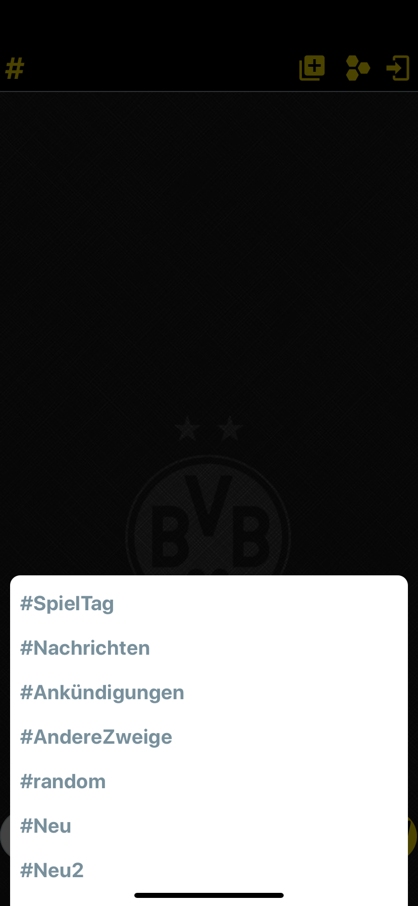

# RN_ChatApp

## Description
.

## Images

## Thanks for  contributions

- https://reactnative.dev
- https://reactnative.dev/help
- Contributors from https://stackoverflow.com

### for Packages

- https://reactnavigation.org
- https://firebase.google.com
- https://github.com/react-native-modal
- https://momentjs.com
- https://github.com/oblador/react-native-vector-icons

## Contact

- GitHub [@Yusuf](https://github.com/ysfoz)
- Linkedin [@Yusuf](https://www.linkedin.com/in/yusuf-öztürk-23617b1b7/)

